# Configuration du serveur et de l'agent SonarQube
**PS** : *On part du prérequis que le serveur Sonar est opétationnel*

### Connexion à sonar en http sur le port 9000 via le navigateur

Il faudra récupérer son IP machine. SI vous êtes sur AWS, il faudra prendre l'IP publique de votre machine


Les credentials par defaut sont **admin/admin**, il faudra changer le mot de passe initial. Pour ne pas trop chercher après, mettre **My_pa55word**


Une fois les crédentials validés, on a l'interface de Sonar qui apparait : 

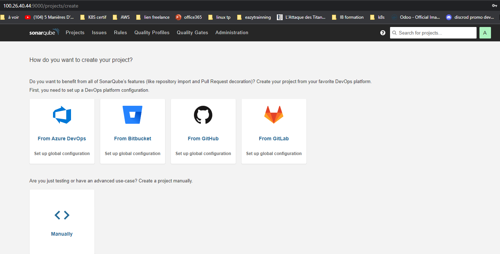

### Collecte des métriques et publication sur le serveur sonnar
Sonnar s'appuit sur des scanners pour analyser le code.

Les SonnarScanner disponibles par défaut sont à [cette url](https://docs.sonarqube.org/latest/analysis/scan/sonarscanner/). A cette adresse, on peut observer des scanners pour différents projets. Nous on est sur [Maven](https://docs.sonarqube.org/latest/analysis/scan/sonarscanner-for-maven/)

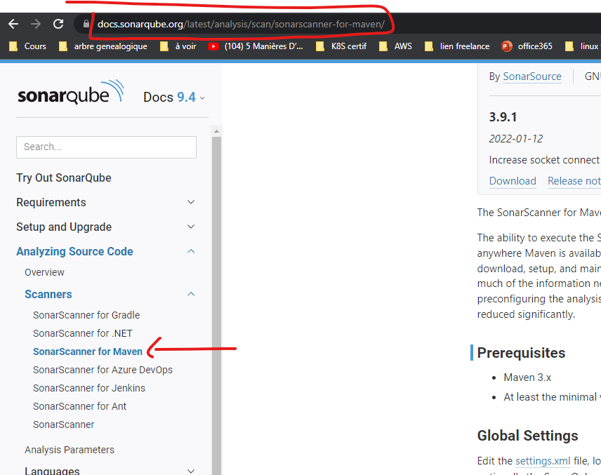

La configuration demande de créer un répertoire **.m2** dans lequel on dépose un fichier de configuration **settings.xml**. 
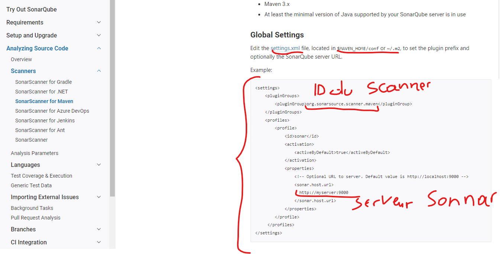

Sur notre projet nous allons le faire la branche **m1ch2**.

```
git checkout m1ch2
```


Création du fichier **.m2/settings.xml**

!!! -- Le fichier vous est fournit avec l'enoncé

```
mkdir .m2
vi  .m2/settings.xml
```
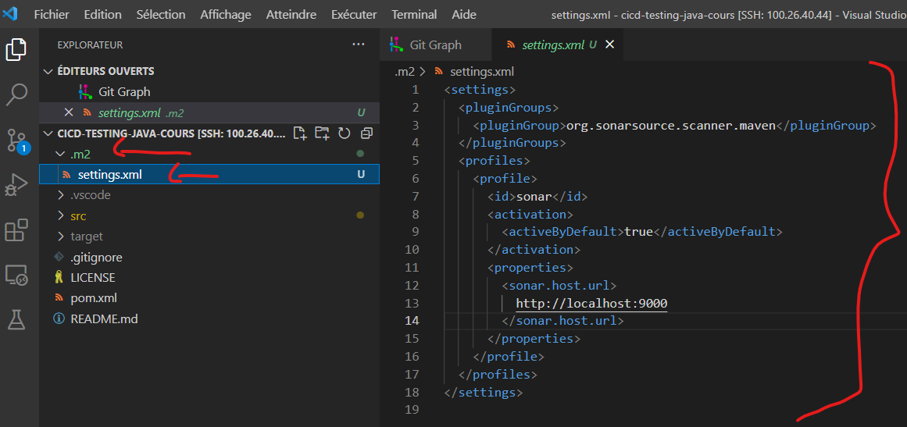

!!! -- L'adresse de sonar est à adapter selon votre infra, si vous êtes dans AWS, il faudrait remplacer localhost par votre IP publique dans AWS
##### Lancement du scan en spécifiant l'emplacement du fichier de configurations 
Pour le faire, on a besoin d'un token d'authentification sur le serveur sonnar. Nous allons d'abord générer ce token et le garder jalousement. Le process est le suivant : 
Connectez vous sur le serveur sonar et suivre la procédure suivante : 

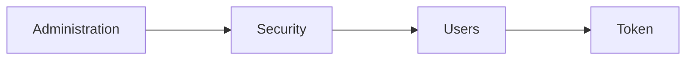
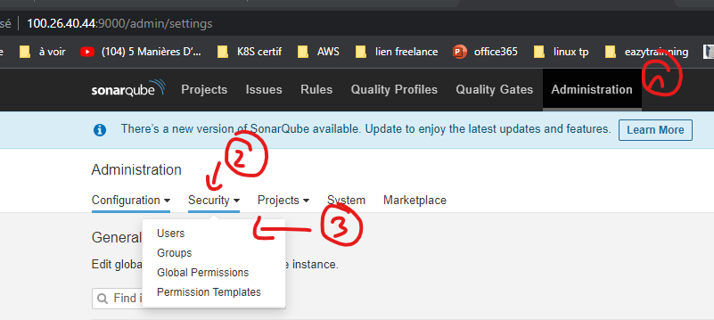
Quand on click sur user, on a ceci, il faudra cliquer sur le petit bouton de menu et générer un token. On lui donnera le nom **calculator**
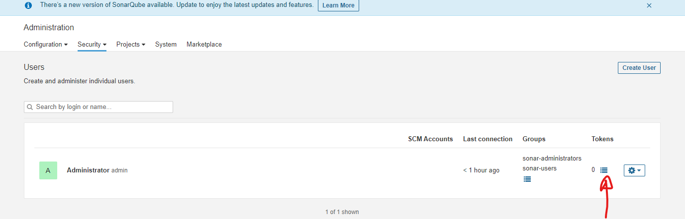

Une fois le token générer, il faudra le copier et le garder jalousement
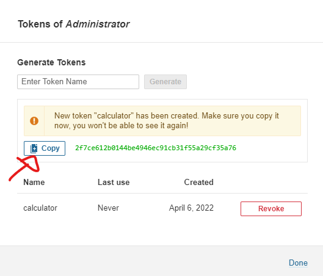

Dans mon cas, le token est le suivant : **17e3dcd113bc290f04d710f0232ccf4ceef42799**

A présent, nous pouvons lancer le scan avec la commande suivante
```
mvn sonar:sonar -s .m2/settings.xml -Dsonar.login=<token>
```
En mettant le token, j'ai ceci dans mon cas : 
```
mvn sonar:sonar -s .m2/settings.xml -Dsonar.login=2f7ce612b0144be4946ec91cb31f55a29cf35a76
```

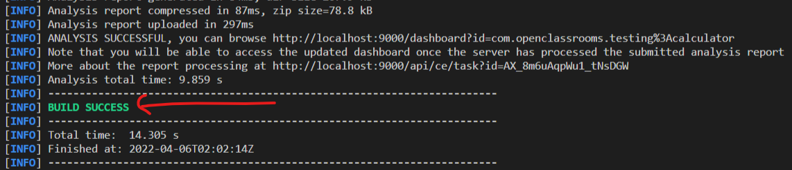

A ce stade, les résultats devraient être présent sur le serveur sonar.
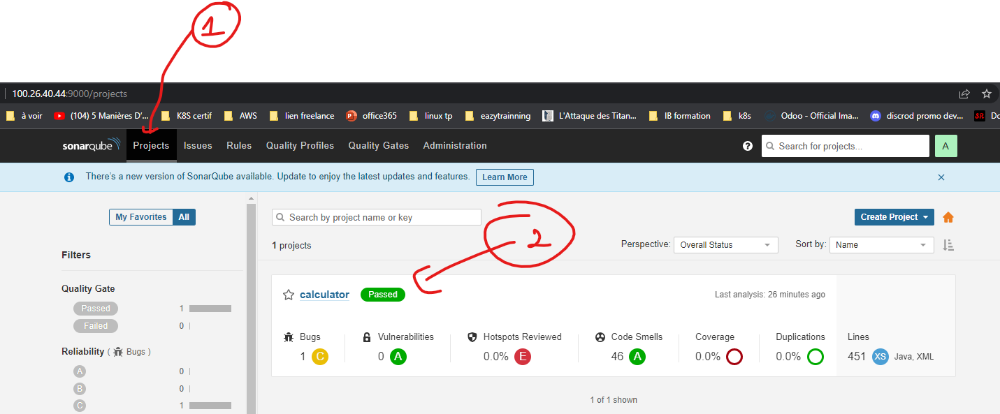

On peut avoir tous les détails du scan en cliquant sur le 
projet calculator

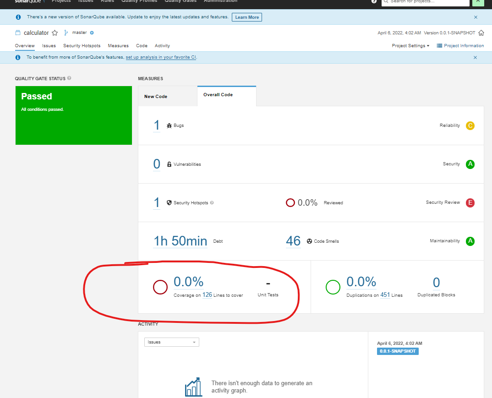

Cependant, on s'apperçoit qu'on a 0% de couverture du code et le scan passe tout de même. celà est lié au fait que sonnar se base sur des **Quality Gates** et des **Quality Profiles**. C'est simplement des sortes de seuils configurés pour définir si un scan est valide ou pas.

Le profil actuel par defaut es **Sonar way**. 

On va tenter de corriger ce soucis de **0% de couverture** dans le prochain TP
