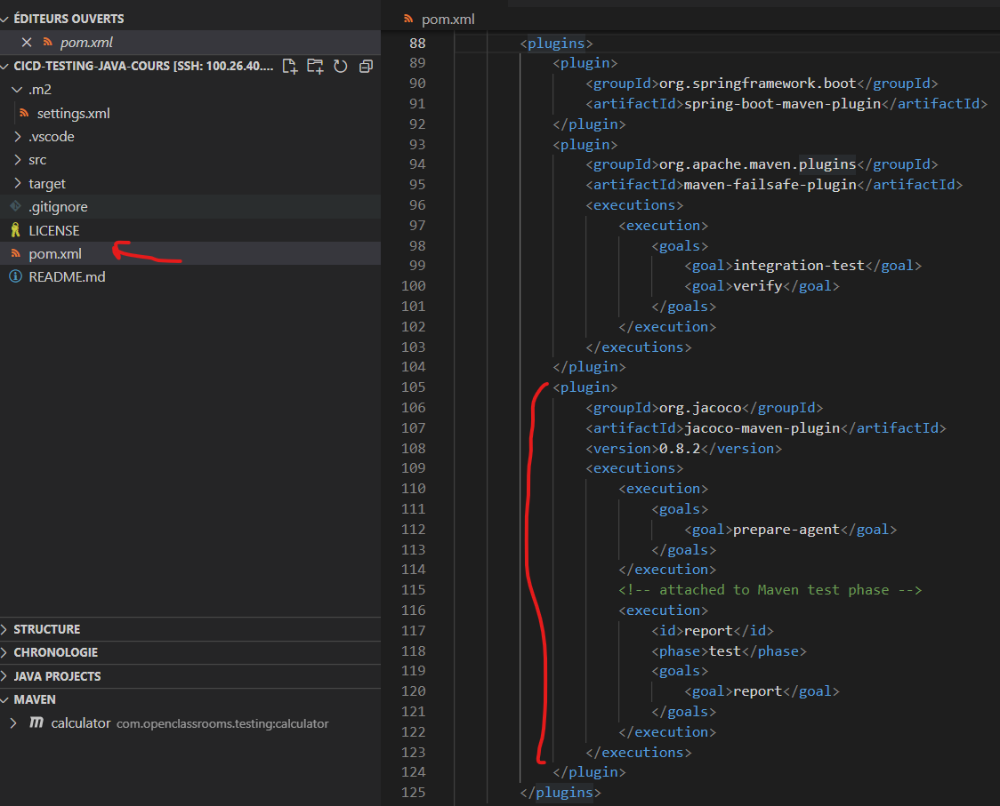
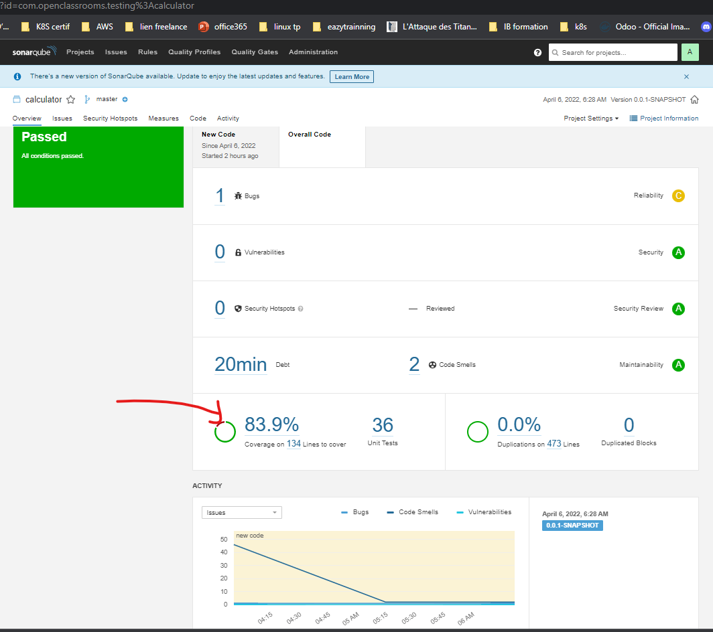

Il est question ici de générer le taux de couverture. Nous allons utiliser un outil qui se nomme **jacoco** (Java Code Coverage). [Voici](https://www.jacoco.org/jacoco/trunk/doc/maven.html) la documentation vers le plugin maven jacoco

Sur votre repos git, commitez le nouveau fichier créé, et deplacer vous dans la branche **m1ch2_OK**
```
git add . 
git commit -m "Add setting.xml for sonnar scan"
git checkout m1ch2_OK
```
Cette branche contient déja la configuration de jacoco nécessaire. Cela est fait dans le fichier ***pom.xml***


On peut voir que des exécutions on été rajoutées. Une exécution c'est simplement un ensemble d'opération qui seront éffectuées dans le cadre du cycle de vie d'un projet maven

Maintentant, nous allons relancer le test  et ensuite renvoyer les résultats à sonnar
```
mvn test
mvn  sonar:sonar -s .m2/settings.xml -D sonar.login="17e3dcd113bc290f04d710f0232ccf4ceef42799"
```

