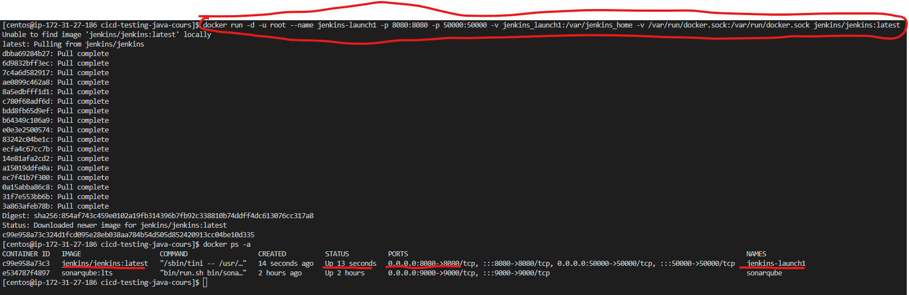
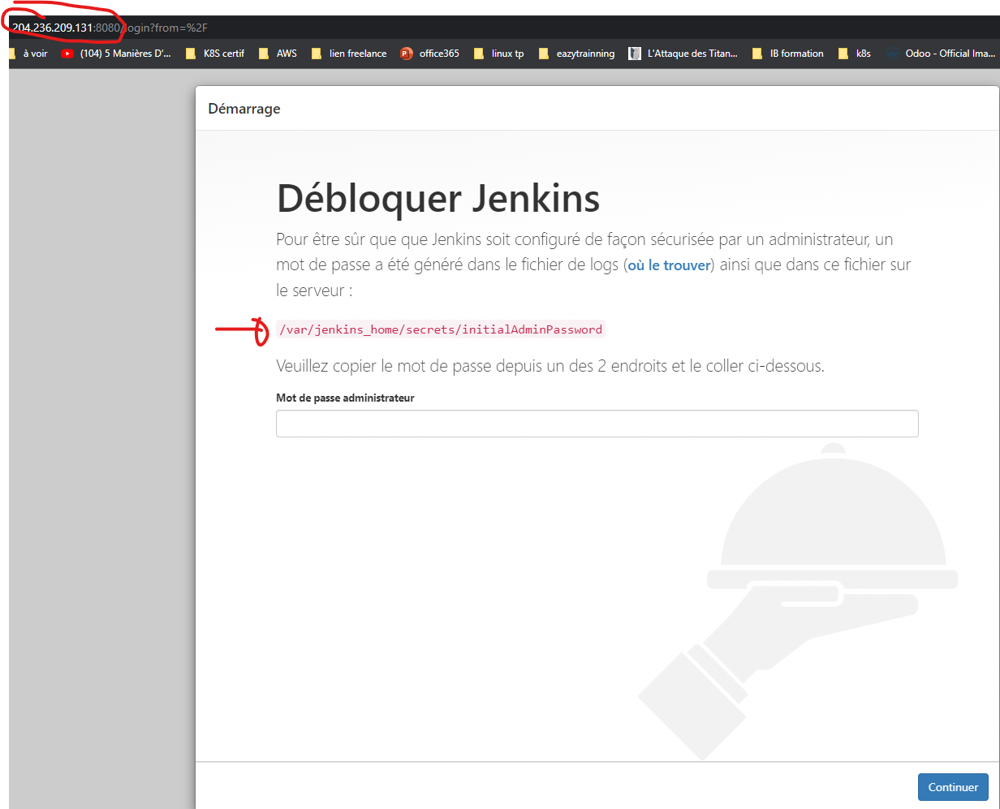
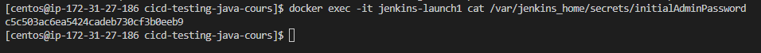
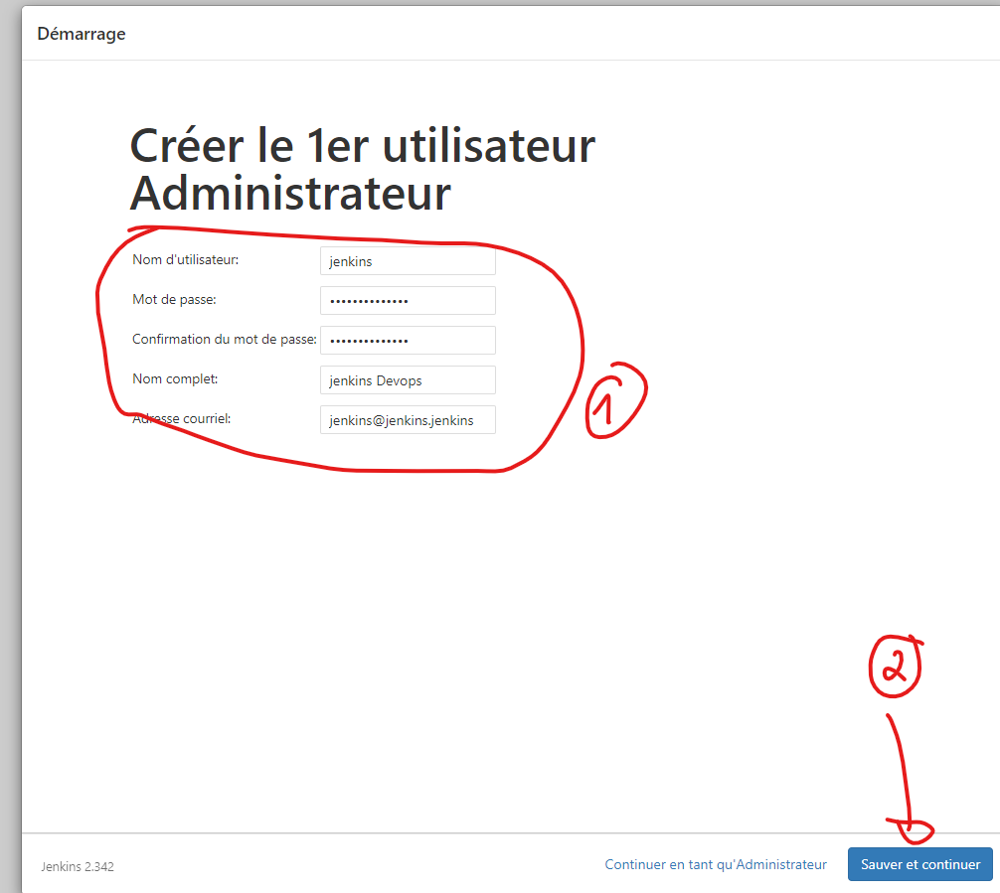
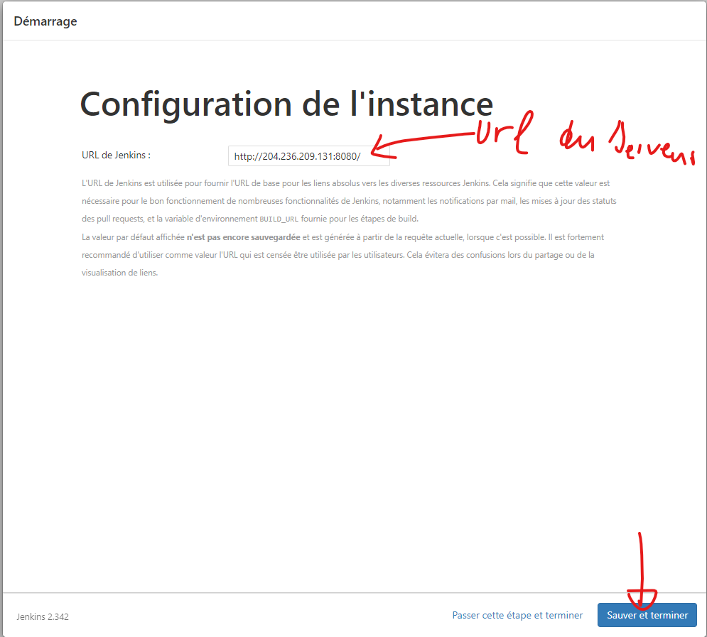
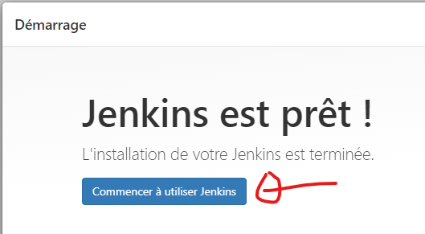
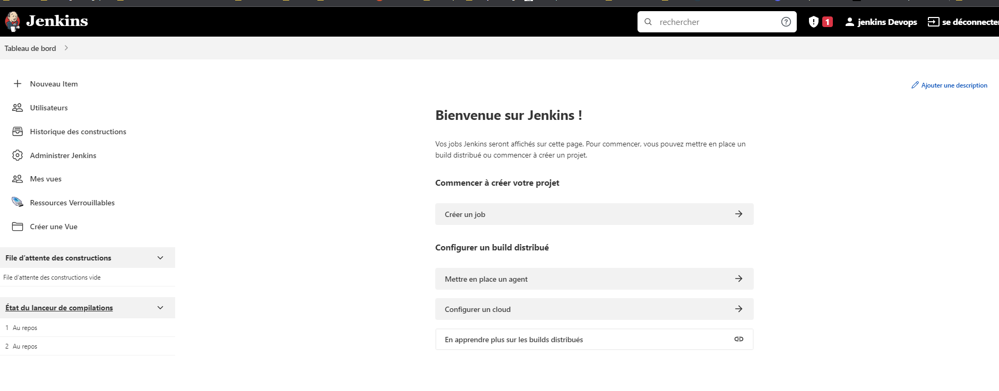

# Installation de Jenkins

Jenkins est un serveur d'integration. Il nous permettra de mettre en place notre chaine CI/CD. Nous allons l'installer sous forme de conteneur dockern sur notre machine aws.

####  Téléchargement de l'image jenkins
```
docker pull jenkins/jenkins
```

####  Lancement du conteneur jenkins
```
docker run -d -u root --name jenkins-launch1 -p 8080:8080 -p 50000:50000 -v jenkins_launch1:/var/jenkins_home -v /var/run/docker.sock:/var/run/docker.sock jenkins/jenkins:latest
```

 
 Une fois le conteneur up, connectez vous au serveur jenkins dans le navigateur pour finaliser l'installation, il est disponible sur le port **8080**
 

 Maintenant, aller récupérer le token à l'endroit précisé et renseignez le dans le formulaires
 ```
 docker exec -it jenkins-launch1 cat /var/jenkins_home/secrets/initialAdminPassword
 ```
 
 
 
 Attendre que l'installation se termine. Ca prendra envirrons **2 min** selon votre machine.

 

 Une fois terminé, créer votre utilisateur et ses crédentials.
 On prendra ceci pour être uniforme : 
 - Nom : **jenkins**
 - Password : **jenkins_devops**
 - Nom complet : **jenkins Devops**
 - Couriel : **jenkins@jenkins.jenkins**





Jenkins est tout prêt à l'emploie à présent

